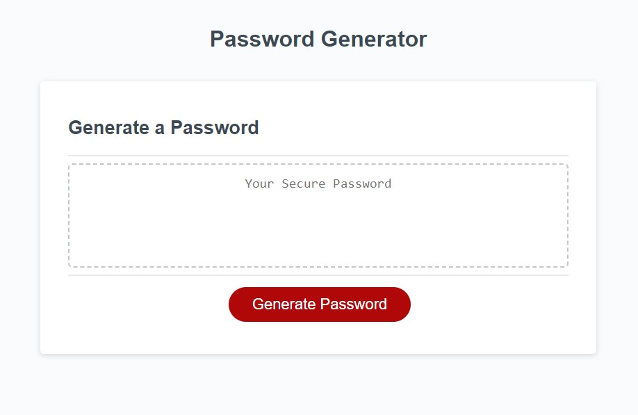

# Password Generator

This application is a password generator that creates a random password based on user's preferences.

This application runs in the browser and features dynamically updated HTML and CSS powered by JavaScript code. 

It has a clean and polished user interface.

## Description

This application is a password generator that creates a random password based on user's preferences. The user can choose the length of the password (between 8 and 128 characters) and the type of characters to include in the password (lowercase, uppercase, numeric, and/or special characters). The application then generates a random password based on the user's input and displays it on the page. When you click the "Generate Password" button, the application prompts you for the password criteria. When you answer each prompt, the application validates your input and makes sure that the password length is between 8 and 128 characters and that at least one character type is selected. If you answer each prompt correctly (click 'Ok' for yes or click 'Cancel' for no), the application generates a password that matches the selected criteria. The password is then written on the textarea provided in the mid-section of the page.

## Getting Started

### Dependencies

* A web browser except Internet Explorer

### Installing

* There is no installation required.

### Executing program

Click🖱️ on the link below to start examining the application.
[Password Generator](https://jyoungjoon.github.io/password-generator/)

## Help

If you have any questions or comments, please contact me at [@lif3scriptified](https://twitter.com/lif3scriptified).

## Authors

Young Jang [@lif3scriptified](https://twitter.com/lif3scriptified)

Starter Code was provided by UC Berkeley Extension FSF Coding Bootcamp 2023

MDN Web Docs were used as a reference for JavaScript syntax and methods.

## Version History

* 0.1
    * Initial Release

## License

This project is licensed under the [MIT] License - see the LICENSE.md file for details

## Acknowledgments

Inspiration, code snippets, etc.
* [awesome-readme](https://github.com/matiassingers/awesome-readme)
* [PurpleBooth](https://gist.github.com/PurpleBooth/109311bb0361f32d87a2)
* [dbader](https://github.com/dbader/readme-template)
* [zenorocha](https://gist.github.com/zenorocha/4526327)
* [fvcproductions](https://gist.github.com/fvcproductions/1bfc2d4aecb01a834b46)